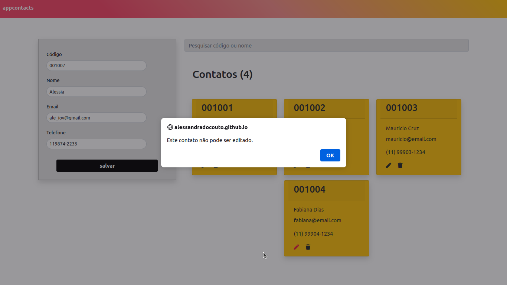

# Projeto CRUD em JAVASCRIPT - Bootstrap & LocalStorage

Abrir link do projeto online: <a href="https://alessandradocouto.github.io/contatosapp-crud/" title="app contatos online" rel="nofollow">app contatos</a>

## :rocket: Sobre o projeto app contatos

Desenvolvimento de um simples projeto CRUD (lista de contatos) utilizando o LocalStorage como banco de dados e linguagem Javascript.

## :books: Conhecimentos adquiridos no Desenvolvimento do Projeto:

    - Respostas(Feedbacks) visuais para o usuário(alertas e inputs);
    - Permite edição e exclusão,, sem carregar a página;
    - Acesso a de dados com o LocalStorage;
    - Uso de regex(expressões regulares) na busca por dados;
    - Manipulação do DOM e Eventos;
    - Utilizando Bootstrap como framework do CSS para construção de um layout responsivo;
    - Sintaxe e semântica do HTML.

#### :star: Feito com entusiasmo e dedicação por <a href="https://www.linkedin.com/in/alessandradocouto/" title="alessandra" rel="nofollow">alessandra</a>

:warning: Atualizações[ Em breve ]